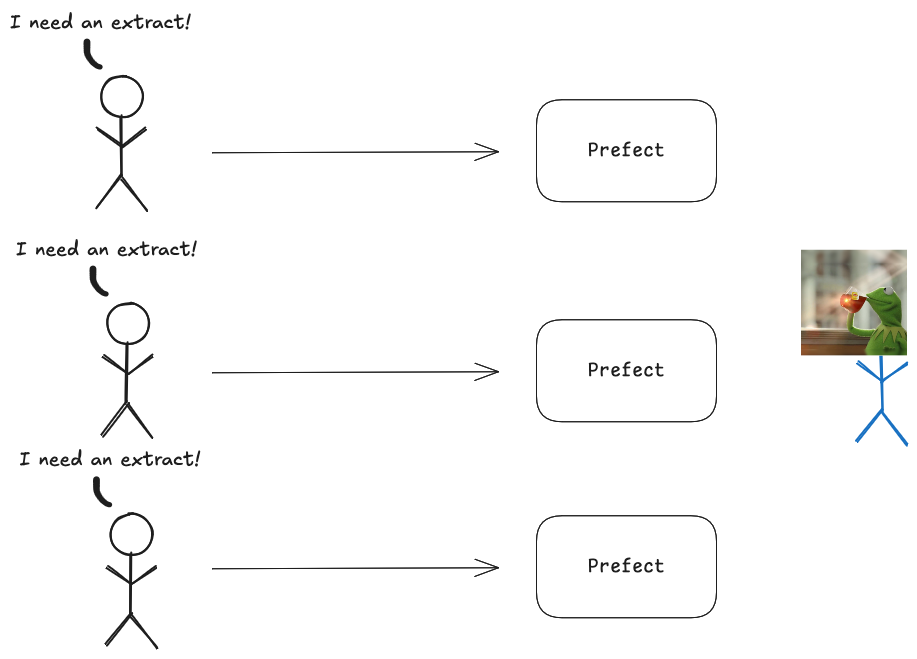

## Introduction

- `omop_es`: OMOP^[**OMOP** = Observational Medical Outcomes Partnership] Extraction System, used to extract hospital observational data in a standardised format
  - UCLH service
  - Data pipeline implemented as a collection of R scripts
- [Prefect](https://docs.prefect.io/v3/get-started/index): data pipeline orchestration system

---

## Current `omop_es` workflow

{fig-align="center"}

---

## Current `omop_es` workflow

{fig-align="center"}

---

## Challenges

- `omop_es` pipeline runs as Docker containers
  - Only one person on the team with the capacity to do this --> bottleneck
- Need for retries because of flaky database connections
- Extracts can take hours to run, so manual retries are costly

---

## Solution

Use **Prefect** to

- Automate scheduled extract runs
- Provide an easy UI for users to run extracts themselves

---

## Solution

{fig-align="center"}

---

## Demo

Demo time

---

## Prefect: technical {.smaller}

- Prefect is open-source
- Python-based; workflows are defined in Python code
  - Existing Python code can be turned into Prefect workflows by "just" adding a decorator
  - For our use case: we simply run the omop_es docker as a subprocess from Python

---

## Prefect: technical {.smaller}

- Deployments provide default configuration for workflows and can be defined in YAML files and source-controlled
- Workflows can be parameterised to provide flexibility
- Workers can be local processes, docker containers, kubernetes pods, AWS EC2 instances, ...; lots of options here
  - We just run a local process in a tmux session (good enough for our use case)
- Concurrency: through multiple workers, but also a single worker can execute multiple runs concurrently

---

## Conclusion

Overall, **Prefect** provides a relatively lightweight orchestration infrastructure to manage data pipelines. Especially useful if the pipeline itself is written in Python, though also usable if it's not (as in our case).

 

<https://github.com/uclh-criu/crdm-tools>

{.absolute bottom=100 left=370 width=300}
